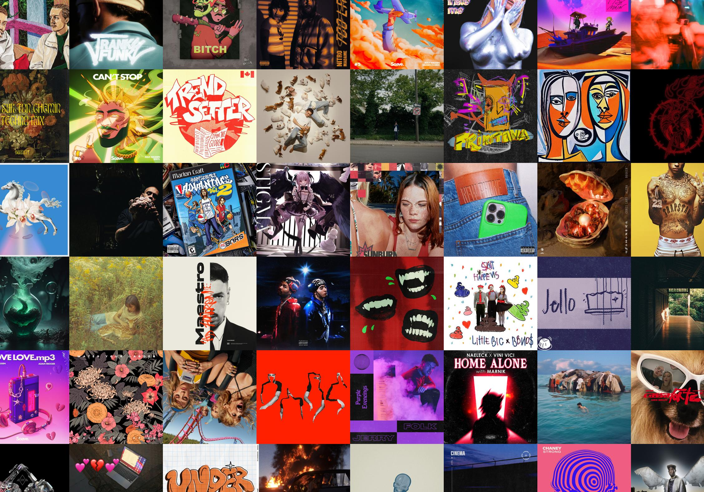

# Spotify Wallpaper Generator

Create your wallpaper using your favourite music albums artworks, without needing any Spotify API keys.

## Usage

Since we do not use any Spotify API keys, we need to use some other website that can give the artwork URLs for us. I choose `https://mytopspotify.io` simply because is the first one I found, and the previews are big enough.

1. Go to `https://mytopspotify.io` and login
2. Navigate to the page that contains the artworks yout want (for example, choose _Top Tracks_ with _top 50_ and _of all the time_)
3. Go to the browser console and paste the content of `getAllImagesURL.js`. It will output all the URLs.
4. Copy those URLs (also the square brackets!!) into a file called `my_urls.json` and place this file in the repo folder
5. Run `python download.py` to download all the images
6. Modify `draw.py` to match your liking: number of rows and pixel size of your screen
7. Run `python3 draw.py`. It will preview a random combination of the artwork, and repeat if you are not satisfied. When you input `y`, it will save the image in `collage.jpg`
8. Enjoy!
